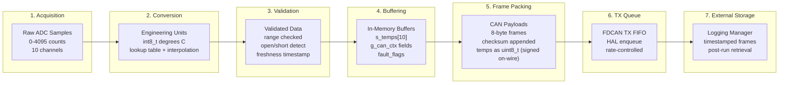

# Data Handling Mechanism

## Overview

The EV Active Sensor Adapter does not maintain long-term persistent storage on-board. All measurements are held transiently in RAM as a structured data model designed to support deterministic sampling, validation, and CAN-FD transmission. This design choice reduces complexity and failure modes (no file system, no flash wear, no SD reliability concerns) while ensuring timing predictability. Long-term storage and retrieval are handled by the vehicle logging manager, which timestamps and records CAN-FD frames for post-run analysis.

Raw thermistor voltages are sampled by the STM32 ADC and converted into temperature values using a lookup table with linear interpolation. After conversion, values are range-checked and assigned validity flags. Each update also records a timestamp and sequence counter to support freshness evaluation and diagnostic reasoning.

The firmware packs the current validated values into periodic CAN-FD frames based on the configured transmission schedule (including round-robin behavior for individual thermistor reporting). Fault conditions (ADC timeout, sensor open/short, invalid sample) are represented as a bitfield and exposed through diagnostic CAN fields and user-visible indicators (LED and UART messages). This architecture provides a clear separation between measurement acquisition, in-memory representation, message packing, and off-board storage, enabling reliable telemetry during vehicle operation and straightforward retrieval from the logging manager.

---

## Data Lifecycle Diagram

---

## Data Dictionary (Firmware Resident Data)

### Thermistor Measurement Data

| Data Item | Type / Size | Units | Source | Update Rate | Validity Rules | Where Used |
|-----------|-------------|-------|--------|-------------|----------------|------------|
| `thermistor_adc_values[10]` | `uint16_t[10]` | ADC counts (0-4095) | STM32 ADC1 | 100 ms (configurable) | Range 0-4095; 0 or 4095 indicates open/short | Conversion input |
| `s_temps[10]` | `int8_t[10]` | Degrees Celsius | Lookup table conversion | On ADC update | -40 to +125 C clamp; invalid if ADC out of range | CAN packing, min/max/avg calc |
| `s_num_temps` | `uint8_t` | Count | Configuration | Static | Must be 1-10 | Iteration bounds |

### CAN Application Context (`g_can_ctx`)

| Data Item | Type / Size | Units | Source | Update Rate | Validity Rules | Where Used |
|-----------|-------------|-------|--------|-------------|----------------|------------|
| `thermistors.thermistor_adc_values[10]` | `uint16_t[10]` | ADC counts | ADC_ServiceTask | 100 ms | Same as above | CAN encoding |
| `thermistors.num_active` | `uint8_t` | Count | ADC_ServiceTask | On update | 0-10 | Message assembly |
| `voltages.voltage_adc_values[14]` | `uint16_t[14]` | ADC counts | SPI (MAX17841) | 200 ms | Valid if SPI OK | Future use |
| `voltages.num_active` | `uint8_t` | Count | SPI driver | On update | 0-14 | Future use |
| `therm_index` | `uint8_t` | Index | Round-robin logic | Per General Broadcast | Wraps 0 to num_active-1 | General Broadcast encoding |
| `last_claim_ms` | `uint32_t` | Milliseconds | HAL_GetTick | On J1939 Claim send | Monotonic | 200 ms period check |
| `last_bms_ms` | `uint32_t` | Milliseconds | HAL_GetTick | On BMS Broadcast send | Monotonic | 100 ms period check |
| `last_general_ms` | `uint32_t` | Milliseconds | HAL_GetTick | On General Broadcast send | Monotonic | 100 ms period check |

### Timing and Freshness

| Data Item | Type / Size | Units | Source | Update Rate | Validity Rules | Where Used |
|-----------|-------------|-------|--------|-------------|----------------|------------|
| `HAL_GetTick()` | `uint32_t` | Milliseconds | SysTick (1 ms) | Continuous | Monotonic, wraps at ~49 days | All timing decisions |
| `s_last_rx_ms` | `uint32_t` | Milliseconds | CAN RX handler | On each RX frame | Updated per frame received | TX gating (RX_GRACE_MS check) |

### Fault and Status Flags

| Data Item | Type / Size | Units | Source | Update Rate | Validity Rules | Where Used |
|-----------|-------------|-------|--------|-------------|----------------|------------|
| `g_fdcan1.ErrorCode` | `uint32_t` | Bitfield | HAL FDCAN driver | On error event | Latched until cleared or queried | Error logging, diagnostics |
| Sensor open/short | Derived | Boolean per channel | ADC value = 0 or 4095 | Per sample | Implicit from ADC bounds | Fault byte in CAN payload |
| CAN TX fail count | (implicit) | Counter | CAN_Comm_SendExt return | Per TX attempt | Logged on failure | Debug output |

### Lookup Table Structure

| Data Item | Type / Size | Units | Source | Update Rate | Validity Rules | Where Used |
|-----------|-------------|-------|--------|-------------|----------------|------------|
| `ThermistorTableEntry_t` | `struct { uint16_t adc; int8_t temp; }` | ADC counts, Degrees C | Compile-time constant | Static | ADC values descending; 115 entries | Binary search + interpolation |

---

## CAN Message Schedule

| Message | CAN ID (Extended) | Period | Payload Size | Payload Contents |
|---------|-------------------|--------|--------------|------------------|
| J1939 Address Claim | `0x18EEFF80` | 200 ms | 8 bytes | Fixed identity fields (unique_id, bms_target, module, constants) |
| BMS Broadcast | `0x1839F380` | 100 ms | 8 bytes | Module number, avg temp, max temp, avg ID, relative ID, fault byte, max ID, checksum |
| General Broadcast | `0x183BF380` | 100 ms (round-robin) | 8 bytes | Module number, thermistor ID, temperature, reserved bytes, checksum |

---

## Data Conversion Pipeline

### ADC to Temperature Conversion

1. **Raw Sample**: STM32 ADC reads thermistor voltage divider (12-bit, 0-4095 counts)
2. **Lookup**: Binary search finds two nearest entries in 115-entry table (ADC descending order)
3. **Interpolation**: Linear interpolation between bracketing entries
4. **Clamp**: Result clamped to int8_t range (-128 to +127, practical range -40 to +125)
5. **Storage**: Stored in `s_temps[]` as signed 8-bit integer

### Temperature to CAN Payload

1. **Read**: `s_temps[i]` is int8_t (-40 to +125 typical)
2. **Cast**: `(uint8_t)s_temps[i]` preserves two's complement bit pattern
3. **Pack**: Placed into `payload[n]` as unsigned byte
4. **Wire**: BMS interprets byte as signed int8_t (e.g., 0xE2 = -30)

---

## Persistence and Retrieval Strategy

### On-Board Storage

- **Type**: RAM only (no Flash, no SD card, no EEPROM)
- **Scope**: Current measurement cycle buffers, timestamps, fault flags
- **Lifetime**: Valid while powered; cleared on reset

### Off-Board Storage

- **Device**: Vehicle logging manager (separate ECU)
- **Format**: Raw CAN-FD frames with timestamps
- **Retrieval**: Post-run download via logging manager interface

### Design Rationale

| Concern | On-Board Storage | Off-Board (Logger) |
|---------|------------------|-------------------|
| Complexity | None (no filesystem) | Logger handles storage |
| Reliability | No wear, no corruption risk | Logger manages media |
| Determinism | Guaranteed timing | Decoupled from adapter |
| Power | Minimal (RAM only) | Logger has own power |
| Retrieval | N/A | Team downloads logs |

This architecture keeps the sensor adapter simple, deterministic, and low-power. The logging manager provides timestamped CAN frame capture for post-run analysis, debugging, and compliance verification.

---

## Data Integrity Mechanisms

### Transmission Integrity

| Mechanism | Implementation | Purpose |
|-----------|----------------|---------|
| Checksum | Sum of payload bytes + 0x39 + length, low 8 bits | Detect payload corruption |
| CAN CRC | Hardware (FDCAN peripheral) | Bit-level error detection |
| Sequence | Round-robin index in General Broadcast | Detect missed frames |
| Freshness | Timestamps in g_can_ctx | Age-gate stale data |

### Fault Detection

| Fault | Detection Method | Response |
|-------|------------------|----------|
| Sensor open | ADC = 4095 (rail high) | Fault bit set in payload |
| Sensor short | ADC = 0 (rail low) | Fault bit set in payload |
| ADC timeout | Service task watchdog | Log error, use last valid |
| CAN TX fail | HAL return code check | Log error, retry next cycle |
| CAN bus-off | HAL state check | Log error, attempt recovery |

---

## Summary

The data handling mechanism provides:

1. **Clear data lifecycle**: Raw samples through validated engineering units to CAN frames
2. **Deterministic timing**: Fixed sample and transmit periods with timestamp tracking
3. **Robust validation**: Range checks, open/short detection, freshness gating
4. **Minimal on-board storage**: RAM-only design eliminates filesystem complexity
5. **Off-board persistence**: Logging manager captures all CAN traffic with timestamps
6. **Data integrity**: Checksums, hardware CRC, sequence counters, fault flags

This design satisfies the requirement to "show the code" for data handling by documenting where data lives (RAM buffers), what format it uses (defined structs and types), how long it is valid (timestamps and freshness checks), how it moves (ADC to conversion to CAN), and how integrity is maintained (checksums, CRC, fault detection).
