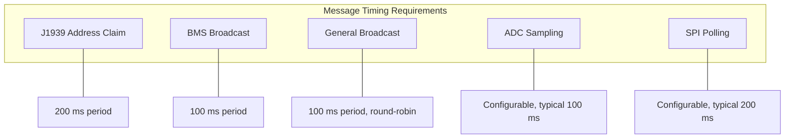
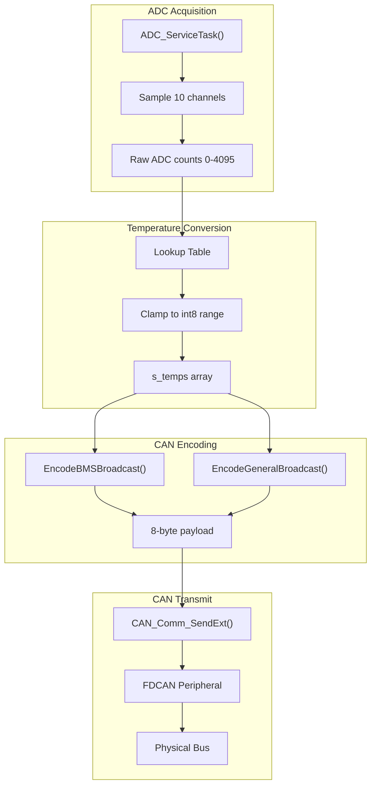
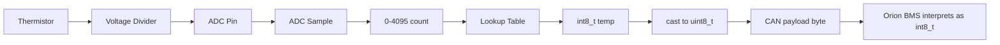
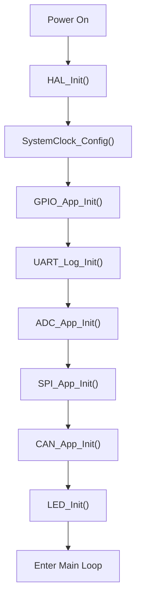
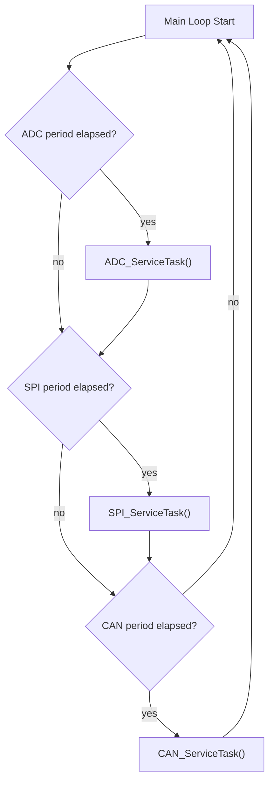

# EV Active Sensor Adapter - Firmware System Architecture

## System Overview

```mermaid
flowchart LR
    subgraph SCHED["Execution and Scheduling"]
        direction TB
        BOOT["Boot and Init"]
        TICK["1ms Timebase"]
        LOOP["Main Service Loop"]
        BOOT --> TICK --> LOOP
    end

    subgraph VOLT["Voltage Lane"]
        direction TB
        V_IN["Cell Taps x14"]
        V_AFE["Analog Front-End"]
        V_ADC["External HV ADC"]
        V_TRS["UART TO SPI TRANSLATOR"]
        V_SPI["SPI Driver"]
        V_PROC["Voltage Processing"]
        V_IN --> V_AFE --> V_ADC <--> V_TRS <-->V_SPI --> V_PROC
    end

    subgraph TEMP["Temperature Lane"]
        direction TB
        T_IN["Thermistors x10"]
        T_ADC["STM32 ADC"]
        T_CONV["Lookup Table Conversion"]
        T_PROC["Temp Processing"]
        T_IN --> T_ADC --> T_CONV --> T_PROC
    end

    subgraph MODEL["Data Model"]
        direction TB
        BUF["Measurement Buffers"]
        META["Timestamps"]
        FAULTS["Fault State"]
        BUF --- META
        META --- FAULTS
    end

    subgraph FRAME["Message Assembly"]
        direction TB
        PACK["Frame Builder"]
        CRC["Checksum"]
        RATE["Rate Control"]
        PACK --> CRC --> RATE
    end

    subgraph CANNET["CAN Transport"]
        direction TB
        CAN_API["CAN API"]
        CAN_HAL["FDCAN HAL"]
        BUS["CAN Bus"]
        CAN_API --> CAN_HAL --> BUS
        BUS --> CAN_HAL --> CAN_API
    end

    subgraph DBG["Debug Interface"]
        direction TB
        LEDS["Status LEDs"]
        UART["UART Console"]
    end

    subgraph CONSUMERS["External Consumers"]
        direction TB
        BMS["Orion BMS"]
        LOGGER["Data Logger"]
    end

    LOOP --> V_SPI
    LOOP --> T_ADC
    V_PROC --> BUF
    T_PROC --> BUF
    BUF --> PACK
    META --> PACK
    FAULTS --> PACK
    RATE --> CAN_API
    CAN_API --> LEDS
    CAN_API --> UART
    FAULTS --> LEDS
    FAULTS --> UART
    BUS --> BMS
    BUS --> LOGGER
```

## Timing Constraints

## Data Flow Detail

## Module Responsibilities

| Module | File | Purpose | Timing |
|--------|------|---------|--------|
| Main | main.c | Init and main loop | Continuous |
| ADC | adc.c | Sample thermistor channels | Periodic |
| SPI | spi.c | Poll MAX17841 for cell data | Periodic |
| Thermistor | thermistor_table.c | ADC to temperature lookup | On demand |
| CAN Messages | can_messages.c | Encode BMS and General frames | On demand |
| CAN Core | can.c | FDCAN init, send, receive | Periodic |
| Timer | timer.c | HAL_GetTick based timing | 1 ms tick |
| Log | log.c | UART debug output | On demand |
| LED | led.c | Status indication | Periodic |
| Error | error_handling.c | Fault handling | On event |

## CAN Message Schedule

| Message | CAN ID | Period | Payload |
|---------|--------|--------|---------|
| J1939 Address Claim | 0x18EEFF80 | 200 ms | 8 bytes fixed |
| BMS Broadcast | 0x1839F380 | 100 ms | Module summary |
| General Broadcast | 0x183BF380 | 100 ms | Single thermistor, round-robin |

## Temperature Data Path

## Initialization Sequence

## Main Loop Execution

