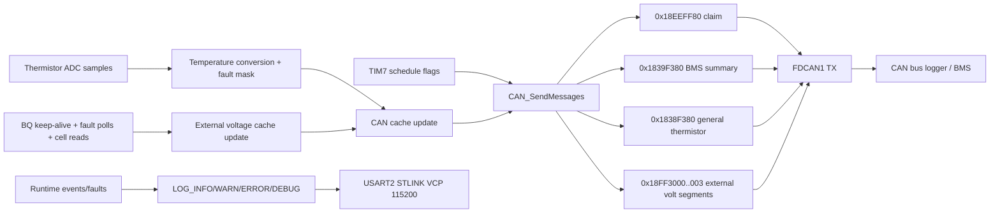

# Communication Flowchart

## Notes

- CAN transmission scheduling is interrupt-flag driven but sent in task context.
- BQ comm loss transitions voltage path to failed state while thermistor CAN path continues.
