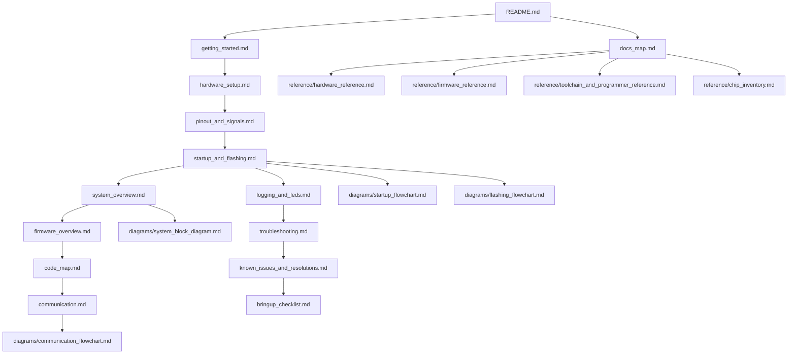

# Documentation Relationship Map

This diagram shows how the documentation is intended to be consumed.

## Reading intent

- Start with onboarding (`getting_started.md`).
- Validate hardware/signal mapping before deep debug.
- Complete flashing/bring-up setup before architecture deep-dive.
- Use troubleshooting and known issues as operational references.
- Use `reference/` files for quick chip/tool/fact lookup.
