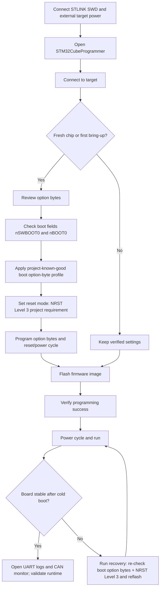

# Flashing Flowchart

## Required project checks

- CubeProgrammer option-byte review is mandatory on fresh chips.
- `nSWBOOT0` / `nBOOT0` boot behavior must be verified for this project.
- Use NRST Level 3 during flashing/setup for reliable bring-up in this project.
