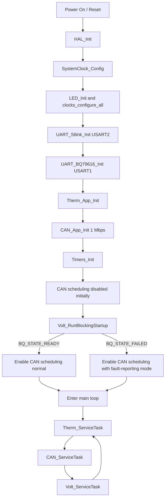

# Startup Flowchart

```mermaid
flowchart TD
    A[Power On / Reset] --> B[HAL_Init]
    B --> C[SystemClock_Config]
    C --> D[LED_Init and clocks_configure_all]
    D --> E[UART_Stlink_Init USART2]
    E --> F[UART_BQ79616_Init USART1]
    F --> G[Therm_App_Init]
    G --> H[CAN_App_Init 1 Mbps]
    H --> I[Timers_Init]
    I --> J[CAN scheduling disabled initially]
    J --> K[Volt_RunBlockingStartup]

    K -->|BQ_STATE_READY| L[Enable CAN scheduling normal]
    K -->|BQ_STATE_FAILED| M[Enable CAN scheduling with fault-reporting mode]

    L --> N[Enter main loop]
    M --> N

    N --> O[Therm_ServiceTask]
    O --> P[CAN_ServiceTask]
    P --> Q[Volt_ServiceTask]
    Q --> O
```

## Observed behavior anchors

- Startup includes one-time `LED_All_Pulse(1000u)` in `main()`.
- BQ startup is a gate before periodic CAN scheduling is released.
