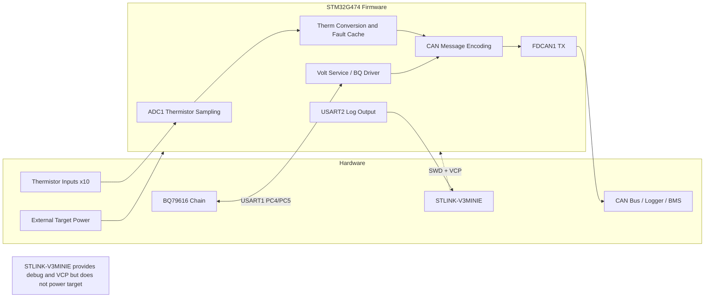

# System Block Diagram

```mermaid
flowchart LR
    subgraph HW[Hardware]
        T1[Thermistor Inputs x10]
        BQ[BQ79616 Chain]
        CANBUS[CAN Bus / Logger / BMS]
        STLINK[STLINK-V3MINIE]
        PWR[External Target Power]
    end

    subgraph MCU[STM32G474 Firmware]
        ADC[ADC1 Thermistor Sampling]
        THERM[Therm Conversion and Fault Cache]
        VMON[Volt Service / BQ Driver]
        CANENC[CAN Message Encoding]
        FDCAN[FDCAN1 TX]
        UARTLOG[USART2 Log Output]
    end

    T1 --> ADC --> THERM --> CANENC --> FDCAN --> CANBUS
    BQ <-- USART1 PC4/PC5 --> VMON --> CANENC
    STLINK -. SWD + VCP .-> MCU
    MCU --> UARTLOG --> STLINK
    PWR --> MCU

    note1[STLINK-V3MINIE provides debug and VCP but does not power target]
```

## Notes

- Therm and BQ paths are both reflected in CAN output.
- BQ failure still allows thermistor CAN path to continue in degraded mode.
